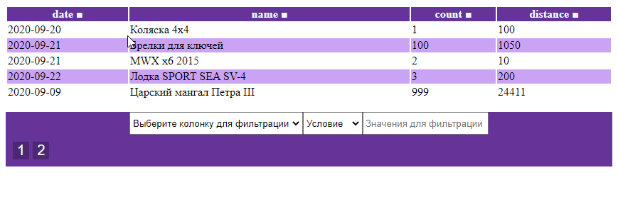

### Нужно разработать таблицу в формате Single Page Application.

#### **Требования к таблице.**

* Таблица должна содержать **4 колонки**: 
  - Дата
  - Название
  - Количество
  - Расстояние

* База данных может быть mySQL/PostgreSQL
* Таблица должна иметь сортировку по всем полям _**кроме даты**_. 
Фильтрация должна быть в виде двух выпадающих списков и текстового поля:
    - Выбор колонки, по которой будет фильтрация
    - Выбор условия (равно, содержить, больше, меньше)
    - Поле для ввода значения для фильтрации
* Таблица должна содержать пагинацию

**Вся таблица должна работать без перезагрузки страницы.**

    Можно использовать:
    возможности нативного JS и PHP
    jQuery/Vue/React/Axios
    CSS библиотеки
    модули Symfony/Zend для работы с БД
    
    Нельзя использовать:
    Библиотеки с готовыми компонентами или плагины для jQuery/Vue/React, которые предоставляют готовый функционал, требуемый в задании
    Библиотеки и плагины для валидации
    CMS системы

**✅ DONE:** 

[]

Реализовано:

 - [x] MySQL база данных (лежит в корне - api.sql)
 - [x] Супер мега простой REST API (хаха) на PHP
 - [x] Сортировка по всем колонкам (кроме даты)
 - [x] Фильтрация по требуемым условиям (кроме даты)
 - [x] Пагинация, с учетом фильтров
 - [x] Работает без перезагрузки страницы

Что можно улучшить:

- Разбить на компоненты [Таблица, Пагинация, Фильтры]
- Сделать отдельный класс помощник для работы с DOM
- Вынести всю дополнительную логику в отдельный файл utils
- Нормальный Rest API на Django или т.п. фреймворках
- С нормальным Reast API получать не все данные, а только постранично
- Сделать прелоадер
- Оповещения в виде toast мессаджей в случае ошибок связи с API
- Улучшить пагинацию, чтобы генерировались не все кнопки, а диапазон ([<<<] [<<] [20] [21] [21] [21] [21] [>>] [>>>])
- Валидация полей фильтров на вводимые значения